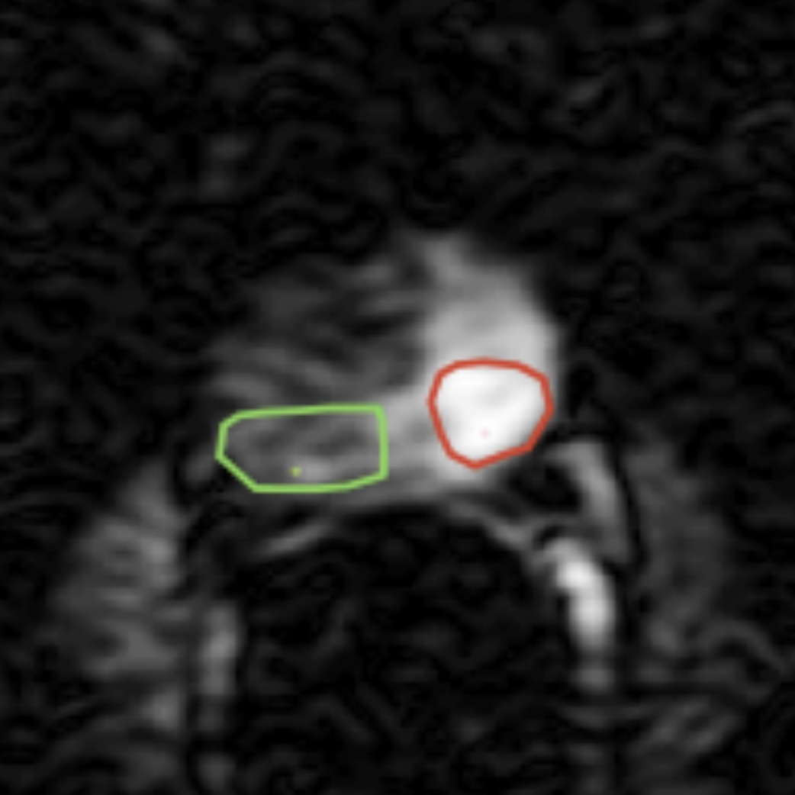

# Modular Bayesian Framework for Diffusivity Spectrum Reconstruction in dMRI

**End-to-end framework for bayesian estimation of diffusivity spectra in diffusion MRI with systematic parameter optimization for cancer biomarker development**

The core challenge is approximating a non-negative multivariate Gaussian that models the diffusivity spectrum R via inverse Laplace transform (s = UR + ε). This framework addresses: (1) minimizing reconstruction error under noise, (2) achieving stable matrix inversion, (3) estimating uncertainty, and (4) optimizing spectral features for cancer classification. The approach enables systematic testing across all parameter combinations and is validated on 63 prostate cancer patients from Brigham and Women's Hospital with expert annotations and Gleason grading.

## Quick Setup & Installation

### Prerequisites
- Python 3.8+
- [uv](https://github.com/astral-sh/uv) package manager  
- SuiteSparse: `brew install suite-sparse` (macOS) or equivalent *(required for cvxopt optimization libraries)*

### Installation
```bash
git clone <repository-url>
cd spectra-estimation-dMRI
uv venv
source .venv/bin/activate  # Windows: `.venv\Scripts\activate`
uv pip install -e .
```

### Verify Installation
```bash
python src/spectra_estimation_dmri/main.py --help
```

## Overview

This framework estimates full diffusivity spectra via Bayesian inverse Laplace transform. This provides:

- **Full spectral information** with uncertainty quantification
- **Robust regularization** through multiple prior options
- **Systematic optimization** across the entire parameter space
- **End-to-end reproducibility** from data to biomarker

The modular design leverages:
- **[Hydra](https://hydra.cc/)** for hierarchical configuration management
- **[WandB](https://wandb.ai/)** for experiment tracking and hyperparameter sweeps  
- **[ArviZ](https://arviz-devs.github.io/arviz/)** for Bayesian model diagnostics and storage

## Workflow Overview


## Data Flow Visualization

From medical imaging to quantitative biomarkers:

<p align="left">

 


</p>

*Left to right: Multi-parametric MRI with radiologist annotations → ROI-averaged signal decays → Bayesian spectrum estimation with uncertainty quantification*

## Research Goals & Hydra Commands

### 1. Matrix Conditioning Optimization
- **Goal**: Minimize ill-conditioning of design matrix U and precision matrix
- **Metric**: cond_U, cond_precision
- **Params**: diff_values, b_values, snr (for precision matrix only), strength (for regularization and precision matrix only)
- **Diagnostics**: parameter combo plot (wandb)

```bash
# Sweep diffusivity discretizations and analyze condition numbers
python src/spectra_estimation_dmri/main.py -m dataset=simulated \
  dataset.spectrum_pairs.test.diff_values="[0.1,0.5,1.0,2.0,5.0]","[0.25,0.75,1.25,2.5,3.0]" \
  dataset.b_values="[0,0.5,1.0,1.5,2.0,2.5,3.0]","[0,0.25,0.75,1.25,2.0,3.5]" \
  diagnostics.only_pre_inference=true \
  diagnostics.max_cond_U=1e12

# Analyze precision matrix conditioning for Gibbs sampling
python src/spectra_estimation_dmri/main.py -m dataset=simulated inference=gibbs \
  prior=ridge,dirichlet prior.strength=0.001,0.01,0.1,1.0 \
  diagnostics.max_cond_precision=1e15
```

### 2. Regularization & Point Estimate Stability  
- **Goal**: Find best (in terms of accuracy, stability, computational efficiency) point estimate (regularized map estimates vs bayesian posterior mean) of diffusivity spectrum for various noise levels.
- **Metric**: recon_err_mean, recon_err_std
- **Params**: 
   - dataset: snr, no_noise, noise_realizations, b_values, spectrum_pairs (diff_values, true_spectrum)
   - inference: gibbs (init, n_iter, burn_in, sampler_snr), map (see prior)
   - prior: type (uniform, ridge, lasso), strength
- **Diagnostics**: parameter combo plot (wandb), trace plot, spectrum stability plot

```bash
# MAP estimate stability across priors and noise levels
python src/spectra_estimation_dmri/main.py -m dataset=simulated inference=map \
  dataset.snr=50,100,300,600,1000 \
  dataset.noise_realizations=10 \
  prior=uniform,ridge,lasso,dirichlet \
  prior.strength=0.0001,0.001,0.01,0.1

# Compare MAP vs Gibbs posterior means
python src/spectra_estimation_dmri/main.py -m dataset=simulated \
  inference=map,gibbs \
  dataset.snr=100,600,1000 \
  prior=ridge,lasso prior.strength=0.001,0.01,0.1
```

### 3. Uncertainty Quantification Assessment
- **Goal**: 
  - Prove / disprove spectrum posterior variance as good reflection of sensitivity in spectrum reconstruction (e.g. when model says "I am 95% right" that is actually true)
  - Prove / disprove spectrum posterior variance as good proxy for prediction uncertainty (e.g. higher posterior variance equals more misclassified cases?)
- **Metric**: posterior_cred_int, cal_anal
- **Params**: true_spectrum, spectrum_vector (bayesian posterior mean), spectrum_std (bayesian posterior standard deviation)
- **Diagnostics**: parameter combo plot (wandb), gibbs spectrum plots (with init), calibration plots, ...

```bash
# Full Bayesian uncertainty quantification
python src/spectra_estimation_dmri/main.py -m dataset=simulated inference=gibbs \
  dataset.snr=50,200,600 \
  dataset.noise_realizations=20 \
  prior=ridge,dirichlet \
  inference.n_iter=10000 inference.burn_in=2000 \
  diagnostics.uncertainty_analysis=true

# Uncertainty calibration across SNR regimes  
python src/spectra_estimation_dmri/main.py -m dataset=simulated inference=gibbs \
  dataset.snr=25,50,100,200,500,1000 \
  dataset.spectrum_pairs.vary_all=true \
  diagnostics.calibration_analysis=true
```

### 4. Cancer Biomarker Optimization
- **Goal**: Find spectrum-derived features that maximize classification performance for Gleason grading, with emphasis on differentiating between the two intermediate-risk tumor groups (GS 3 + 4 = 7 vs GS 4 + 3 = 7), as ADC (current clinical standard) seems to struggle with its discriminatory ability here, see [1, 2, 3].
- **Metric**: auc, p_value, qwk
- **Params**: 
  - spectra_dataset
  - classifier: manual, logistic_regression (...) 
- **Diagnostics**: parameter combo plot (wandb), Spectrum-based feature x GGG correlation plots (comparison mean and std), ROC Curves (e.g. low-v-mid, mid-v-high, low-v-high as comparison)


```bash
# Real patient data classification
python src/spectra_estimation_dmri/main.py -m dataset=bwh \
  inference=map,gibbs \
  prior=ridge,lasso,dirichlet \
  classifier=logistic_regression \
  classifier.target=ggg,is_tumor \
  classifier.cv_folds=5

# Optimize for mid-grade Gleason discrimination
python src/spectra_estimation_dmri/main.py -m dataset=bwh \
  inference=gibbs prior=ridge,dirichlet \
  classifier=logistic_regression \
  classifier.target=ggg_binary_34_vs_43 \
  classifier.metrics=auc,weighted_kappa,sensitivity,specificity
```

## Scientific Motivation

### Current Limitations and Clinical Need

Prostate cancer management relies heavily on tissue biopsy for Gleason grading, which is invasive and carries risk of complications. While imaging-based biomarkers like ADC offer non-invasive alternatives, there are some limitations, particularly for **mid-grade Gleason score discrimination** (3+4 vs 4+3) that is crucial for treatment decisions [1,2,3,4,5]. The long-term clinical goal is developing robust imaging biomarkers that could reduce unnecessary biopsies while providing reliable prognostic information to guide treatment planning.

### Our Spectrum-Based Approach: Work in Progress

**Important Note**: This work is still in progress, and we do not yet know whether our method provides meaningful advantages over existing ADC approaches. 

**Acknowledged Challenges**:
- **Mathematical complexity**: Our approach requires solving an ill-conditioned inverse Laplace transform, making it mathematically more challenging than direct ADC computation
- **Computational burden**: Current implementation relies on Gibbs sampling, which is computationally inefficient compared to simple ADC calculation
- **Similar dependencies**: Like ADC, our method depends on b-value selection, ROI size, and measurement protocols

**Potential Advantages Under Investigation**:
- **Rich spectral information**: Full diffusivity distributions rather than single summary values
- **Uncertainty quantification**: Bayesian posteriors provide confidence intervals that could inform radiologists about prediction reliability
- **Detailed tissue characterization**: Spectral features may capture subtle tissue compartment differences that single ADC values miss

The central hypothesis is that despite increased computational cost and mathematical complexity, the additional information from full spectral estimation with uncertainty quantification might enable more robust biomarkers for differentiating cancer aggressiveness, particularly in the challenging mid-grade cases where current methods struggle.

## Data

### BWH Patient Dataset
- **Source**: [Langkilde et al. (2017)](https://pubmed.ncbi.nlm.nih.gov/28718517/) study  
- **Size**: 63 prostate cancer patients, HIPAA-compliant
- **Regions**: Peripheral zone (PZ) and transitional zone (TZ)
- **Labels**: Tumor vs normal tissue, Gleason grades (GGG 1-5)
- **Acquisition**: 15 b-values (0-3500 s/mm²), multi-ROI per patient

### Simulated Data
- **Ground truth spectra** for method validation
- **Controllable SNR** (25-1000) for noise robustness analysis  
- **Multiple tissue types** (normal PZ/TZ, tumor PZ/TZ) from real patient fits
- **Realistic noise models** based on voxel count and acquisition parameters

## Core Methods

### Probabilistic Model
The diffusion signal follows: **s = UR + ε**
- **s**: Observed signal decay (15 b-values)
- **U**: Design matrix with exp(-b·d) kernels  
- **R**: Diffusivity spectrum (target, 10 bins)
- **ε**: Gaussian noise (SNR-dependent)

### Inference Methods
1. **MAP Estimation**: Optimization with various priors
2. **Gibbs Sampling**: MCMC for full posterior with adaptive proposals
3. **Variational Bayes**: Mean-field approximation (planned)

### Prior Options
- **Uniform**: Minimal regularization, non-negativity only
- **Ridge (L2)**: Smooth spectra, controllable strength  
- **Lasso (L1)**: Sparse spectra, automatic feature selection (only MAP, no full bayesina approach, because no conjugate-prior)
- **Dirichlet**: Simplex constraint, probabilistic interpretation (not implemented yet)

## Configuration System

Hydra enables systematic parameter sweeps and reproducible experiments:

```yaml
# configs/config.yaml
defaults:
  - dataset: simulated  # or bwh
  - prior: ridge        # uniform, ridge, lasso, dirichlet  
  - inference: map      # map, gibbs, vb
  - classifier: logistic_regression
  - diagnostics: diagnostics

experiment_name: "spectrum_optimization"
seed: 42
recompute: false
```

Override any parameter:
```bash
python src/spectra_estimation_dmri/main.py dataset.snr=300 prior.strength=0.01 inference.n_iter=5000
```

## Results & Diagnostics

### Automated Analysis
- **Spectrum recovery plots** with confidence intervals
- **Trace plots** for MCMC convergence assessment  
- **Condition number analysis** for numerical stability
- **Classification performance** with cross-validation
- **Uncertainty calibration** analysis

### Experiment Tracking
- **WandB integration**: Automatic logging of metrics, plots, hyperparameters
- **ArviZ storage**: Posterior samples with Bayesian diagnostics
- **Reproducible caching**: Hash-based result storage for expensive computations

## Project Structure

```
├── configs/                    # Hydra configuration hierarchy
│   ├── dataset/               # simulated.yaml, bwh.yaml
│   ├── prior/                 # uniform.yaml, ridge.yaml, etc.
│   ├── inference/             # map.yaml, gibbs.yaml, vb.yaml  
│   └── config.yaml            # Main configuration
├── src/spectra_estimation_dmri/
│   ├── data/                  # Pydantic models, loaders
│   ├── models/                # Probabilistic model implementations
│   ├── inference/             # MAP optimization, MCMC samplers
│   ├── simulation/            # Data generation utilities
│   ├── utils/                 # Plotting, diagnostics, hashing
│   └── main.py                # Main experiment orchestration
├── results/                   # Cached inference outputs (.nc files)
└── outputs/                   # Hydra run directories
```


## Citations

**Framework components:**
- Configuration management: [Hydra](https://hydra.cc/)
- Experiment tracking: [WandB](https://wandb.ai/)  
- Bayesian diagnostics: [ArviZ](https://arviz-devs.github.io/arviz/)

**Data source:**
Langkilde, F., et al. "Prediction of pathological outcome and biochemical recurrence after radical prostatectomy by quantitative histopathological assessment and multiparametric MRI." *Histopathology* 71.6 (2017): 1032-1044. [DOI: 10.1111/his.13311](https://pubmed.ncbi.nlm.nih.gov/28718517/)

**ADC limitations for mid-grade discrimination:**
1. Manetta, R., et al. "Correlation between ADC values and Gleason score in evaluation of prostate cancer: multicentre experience and review of the literature." *Gland Surgery* 8.Suppl 3 (2019): S216. 
2. Yan, X., et al. "The value of apparent diffusion coefficient values in predicting Gleason grading of low to intermediate-risk prostate cancer." *Insights into Imaging* 15.1 (2024): 137.
3. Rosenkrantz, A.B., et al. "Whole-lesion apparent diffusion coefficient metrics as a marker of percentage Gleason 4 component within Gleason 7 prostate cancer at radical prostatectomy." *Journal of Magnetic Resonance Imaging* 41.3 (2015): 708-714. [DOI: 10.1002/jmri.24598](https://pubmed.ncbi.nlm.nih.gov/24616064/)
4. Nougaret, S., et al. "Whole-Tumor Quantitative Apparent Diffusion Coefficient Histogram and Texture Analysis to Predict Gleason Score Upgrading in Intermediate-Risk 3 + 4 = 7 Prostate Cancer." *American Journal of Roentgenology* 206.4 (2016): 775-782. [DOI: 10.2214/AJR.15.15462](https://www.ajronline.org/doi/10.2214/AJR.15.15462)
5. Donati, O.F., et al. "Prostate cancer aggressiveness: assessment with whole-lesion histogram analysis of the apparent diffusion coefficient." *Radiology* 271.1 (2014): 143-152. [DOI: 10.1148/radiol.13130973](https://pubmed.ncbi.nlm.nih.gov/24475824/)

---

Some final blabla:
*This work represents a systematic approach to quantitative medical imaging biomarker development, enabling principled comparison of methods and reproducible research workflows for advancing precision medicine through robust, non-invasive image-based biomarkers.*
*Personal mission related to prostate cancer: make image-based prostate cancer grading the clinical standard, avoiding costly and uncomfortable biopsies.*
